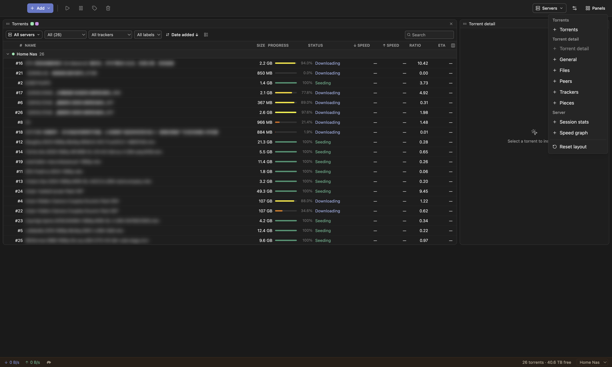
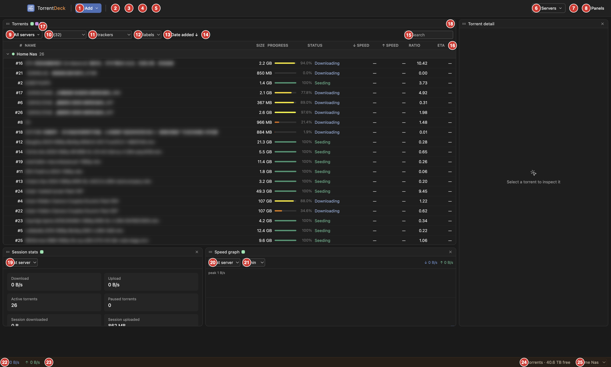
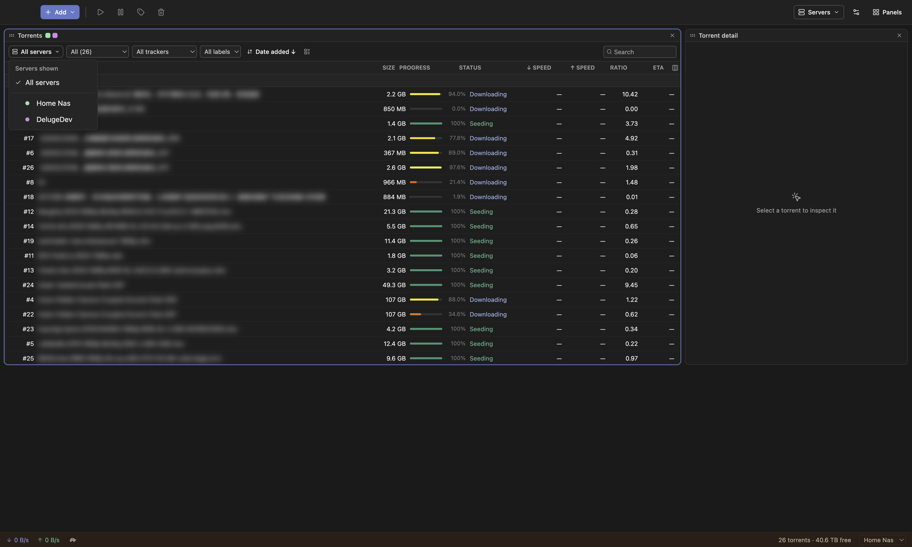

# TorrentDeck — User Guide

TorrentDeck is a desktop app for **remote-controlling BitTorrent daemons**. It
talks to **Transmission 4.x**, **Deluge 2.x**, and **qBittorrent 4.1+/5.x** servers, and
can show several of them at once in a single, rearrangeable workspace.

It does not download torrents itself — it's a remote control for a daemon running
elsewhere (your NAS, a seedbox, another machine, or localhost).

> Torrent names in the screenshots below are intentionally blurred.

- [Requirements](#requirements)
- [Launching the app](#launching-the-app)
- [Adding a server](#adding-a-server)
- [The main window](#the-main-window)
- [Interface reference](#interface-reference)
- [Managing servers](#managing-servers)
- [Adding torrents](#adding-torrents)
- [Working with torrents](#working-with-torrents)
- [The detail panel](#the-detail-panel)
- [Panels](#panels)
- [Server settings](#server-settings)
- [What each server supports](#what-each-server-supports)
- [Keyboard shortcuts](#keyboard-shortcuts)
- [System tray](#system-tray)
- [Troubleshooting](#troubleshooting)

---

## Requirements

You need a running daemon to connect to:

- **Transmission 4.0+** with its RPC enabled (default port `9091`, path `/transmission/rpc`).
- **Deluge 2.x** with the **Web UI** (`deluge-web`) running (default port `8112`, path
  `/json`). The app talks to the Web UI, not the `deluged` core directly, so the Web UI
  must be running and bound to a daemon.
- **qBittorrent 4.1+ or 5.x** with the **Web UI** enabled (Tools → Options → Web UI;
  default port `8080`). Use its Web UI username and password.

See [What each server supports](#what-each-server-supports) for the per-daemon feature
differences.

---

## Launching the app

Grab the release for your platform (macOS / Windows / Linux) and launch it like any other
app. The first time you open it with no servers configured, you'll be prompted to **Add a
server**.

---

## Adding a server

Open the **Servers** menu (top-right) → **Add server…**, or click **Add server** on the
welcome screen. Fill in the connection details:

| Field | Notes |
| --- | --- |
| **Display name** | Whatever you want to call it ("Home NAS", "Seedbox"). |
| **Server type** | **Transmission**, **Deluge**, or **qBittorrent** — this sets sensible defaults and tailors the form. |
| **Host** / **Port** | Address of the daemon. Defaults: Transmission `9091`, Deluge `8112`, qBittorrent `8080`. |
| **RPC path** / **Web UI path** | Transmission `/transmission/rpc`, Deluge `/json`. qBittorrent needs no path (hidden). |
| **Use HTTPS** | Enable if the daemon is behind TLS. A second checkbox lets you trust a self-signed certificate. |
| **Username / Password** | Transmission and **qBittorrent** use both. **Deluge uses only a Web UI password** (no username). |

Click **Test connection** to verify before saving — it reports the connected daemon's
version, or an actionable error (auth vs. TLS vs. network). Then **Save**.

You can add as many servers as you like; there is no single "primary" server — each panel
picks which server(s) it shows.

---

## The main window

The window is a **workspace of panels** you can rearrange freely. A typical layout:

- **Toolbar** (top): quick actions for the selection (start, pause, labels, remove), the
  **Add** menu, the **Servers** menu, and **Panels**.
- **Workspace**: a single, app-wide arrangement of panels (saved automatically). There's
  no single "active" server — each panel chooses the server(s) it shows.

### Arranging panels

Open the **Panels** menu (top-right) to add a panel; every type is grouped by category:

- **Add** — pick a panel from the menu; it drops into the first free spot on the grid.
  (Single-instance panels like the tabbed *Torrent detail* are greyed out once present.)
- **Move** — drag a panel by its header.
- **Resize** — drag its bottom or bottom-right edge.
- **Remove** — click the **✕** on the panel's header.
- **Reset layout** — restores the default arrangement from the bottom of the Panels menu.

### Server colors

Each server gets a **stable pastel color** (derived from the server, so it's the same
every launch). It shows as small **squares next to a panel's title** — one per server the
panel displays, so a multi-server Torrents panel reads as a little swatch row — and as
**dots** beside server names in menus and group headers. Same server, same color
everywhere, so you always know whose data you're looking at.

---

## Interface reference

A fully-loaded workspace, with every control numbered:

**Toolbar**

1. **Add** — add a torrent; the ▾ opens options (paste a magnet, choose a `.torrent`).
2. **Start** the selected torrent(s).
3. **Pause** the selected torrent(s).
4. **Set labels** on the selection.
5. **Remove** the selection (optionally deleting downloaded data).
6. **Servers** — list, add, and edit your servers.
7. **Settings** — Server settings, Bandwidth groups, Preferences, and Keyboard shortcuts.
8. **Panels** — add a panel, or reset the layout.

**Torrents panel**

9. **Server scope** — show all servers or pick which ones this panel lists.
10. **Status filter** — All / Downloading / Seeding / Paused / Verifying / Error.
11. **Tracker filter** — narrow to one tracker.
12. **Label filter** — narrow to one label/tag.
13. **Sort** — choose the sort field and direction.
14. **View toggle** — switch between card and table views.
15. **Search** — filter the visible list by name.
16. **Columns** — choose which columns show (table view).
17. **Panel title + server swatches** — the panel's server(s), color-coded; drag the
    header to move the panel, drag its edge to resize.
18. **Close panel** (✕) — remove this panel from the workspace.

**Session stats & Speed graph**

19. **Stats server** — which server the statistics are for.
20. **Graph server** — which server the speed graph plots.
21. **Graph window** — the time span shown (1 / 5 / 15 min).

**Status bar**

22. **Speeds** — download / upload for the status-bar server.
23. **Alt-speed (turtle)** — toggle alternative speed limits (Transmission).
24. **Torrent count · free space** — for the status-bar server.
25. **Status-bar server** — which server the status bar reflects.

The **Torrent detail** panel (top-right) fills in when you select a torrent — see
[The detail panel](#the-detail-panel).

---

## Managing servers

The **Servers** menu lists every configured server (with its color dot). Click one to
**edit** it, or choose **Add server…**.

---

## Adding torrents

Use the **Add** button (▾ for options), drag a `.torrent` file onto the window, or open a
`magnet:` link (the app can register as your system handler for magnets).

- **Add to server** — choose which server receives the torrent. Your last choice is
  remembered.
- **Magnet link / file** — paste a magnet (the clipboard is auto-detected) or pick a
  `.torrent`.
- **Destination folder** — defaults to the server's download folder; free space is shown.
- **Labels** — optional, comma-separated (Transmission and qBittorrent, where they're
  tags; Deluge if its Label plugin is on).
- **Add paused** — add without starting.

For a single `.torrent` you can also uncheck individual files before adding.

---

## Working with torrents

**Select** a torrent by clicking it; ⌘/Ctrl-click to multi-select within one server (a
selection never spans servers). Selecting drives the detail panels.

**Actions** — from the toolbar or the right-click context menu:

- Start / Start now / Pause
- Verify local data
- Ask tracker for more peers (reannounce)
- Set labels…
- **Queue**: move to top / up / down / bottom, or set an exact position
- Remove… (optionally deleting local data)

**Filter, search, sort** — each Torrents panel has its own filter bar: filter by status,
tracker, or label, type in **Search**, and click a column header (table view) or the
**sort** control to reorder. Switch between **cards** and **table** views with the view
toggle. In table view you can reorder and resize columns, and — when sorted by queue
position — drag rows to reorder the queue.

**Choosing which servers a panel shows** — click the Torrents panel's server selector (the
left-most button in its filter bar, e.g. **All servers**) to show every server or tick a
specific set:

Torrents are grouped under a collapsible header (with the server's color dot) per server;
an unreachable server only errors its own section. The **Session stats** and **Speed
graph** panels have their own single-server picker in their header, and the detail panels
follow whatever torrent you select — so each panel is independently pointed at a server
(see the [Panels](#panels) table).

---

## The detail panel

Select a torrent to populate the **Torrent detail** panel. Its tabs:

- **General** — status, sizes, ratio, dates, pieces summary, creator/comment, hash, and a
  **Speed & limits** section for per-torrent download/upload caps, seed-ratio, connection
  limit, and (Transmission) priority, bandwidth group, and sequential download.
- **Files** — per-file sizes and progress in a collapsible tree; set file priorities or
  deselect files you don't want.
- **Peers** — connected peers.
- **Trackers** — the torrent's trackers.
- **Pieces** — a piece map (on Transmission, with per-piece availability; on Deluge it
  shows overall progress).

You can also add **individual** detail tabs (General, Files, …) as standalone panels.

---

## Panels

| Panel | What it shows | Server |
| --- | --- | --- |
| **Torrents** | The torrent list | One or several — pick in its server selector |
| **Torrent detail** (and single tabs) | The selected torrent | Follows your selection |
| **Session stats** | Totals: speeds, counts, all-time, free space | Its own picker |
| **Speed graph** | Live ↓/↑ throughput | Its own picker |

Add any of these from **Panels → Add panel**. Server-reading panels (Session stats, Speed
graph) each carry a small server picker in their header.

---

## Server settings

**Servers menu area → the settings (⚙) menu → Server settings** opens the daemon-wide
settings. The dialog is **tabbed, one tab per server**, so you can manage every daemon
from one place — each tab shows only what that server supports.

Covers: default download folder, global speed limits, seeding (stop-at-ratio,
start-added), peers/encryption/port, and — **Transmission only** — alternative-speed
limits with a schedule, and the blocklist.

---

## What each server supports

The app hides controls a server doesn't support, so you only see what works. In short:

- **All three**: list, add/remove, start/pause/verify/reannounce, detail tabs, per-torrent
  limits + file priorities, queue reorder, free space, global speed limits, sequential
  download, and labels.
- **Transmission & qBittorrent**: path rename and per-tracker swarm scrape; both also show
  a piece **have-map** (which pieces you have).
- **Transmission only**: bandwidth groups, alternative-speed scheduler, blocklist, a port
  test, and per-piece **availability** (how many peers have each piece).
- **Labels**: Transmission and qBittorrent allow **multiple** per torrent (qBittorrent
  calls them *tags*); Deluge needs its **Label plugin** and allows **one** per torrent.
- **Deluge**: the pieces map shows overall progress only (no per-piece map).

Full Deluge-vs-Transmission breakdown: **[DELUGE.md](DELUGE.md)**; qBittorrent specifics:
**[QBITTORRENT.md](QBITTORRENT.md)**.

---

## Keyboard shortcuts

Shortcuts act on the **focused** Torrents panel (click a panel to focus it — it gets a
highlighted border) and the current selection. With the mouse: **click** a row to select
it, **⌘/Ctrl-click** to add/remove rows from the selection (within one server).

| Key | Action |
| --- | --- |
| **↑ / ↓** | Move the selection up / down the list |
| **Shift + ↑ / ↓** | Extend the selection (within one server) |
| **⌘/Ctrl + A** | Select all torrents in a server |
| **Space** | Start / pause the selection |
| **Delete** (or **⌘/Ctrl + Backspace**) | Remove… (opens the confirm dialog) |
| **Esc** | Clear the selection |

A selection never spans servers: selecting in one server's group replaces a selection held
in another.

---

## System tray

The app can live in the system tray / menu bar: it shows combined speeds in the tooltip
and offers **Pause all / Resume all** (across every configured server) and show/hide.
Enable **close-to-tray** in Preferences to keep it running when you close the window.

---

## Troubleshooting

- **"Authentication failed"** — check the username/password (Deluge: the Web UI
  password). Use **Test connection** in the server editor.
- **"Certificate rejected"** — the server uses a self-signed cert; enable **Use HTTPS →
  Allow self-signed certificate** for that server.
- **"The server did not respond in time"** — the daemon is unreachable (wrong host/port,
  not running, or blocked by a firewall).
- **Deluge: "no configured daemon host" / can't connect** — the Deluge **Web UI must be
  running** and bound to a `deluged` host. The app auto-binds when there's a single host;
  if your Web UI knows several daemons and none is connected, connect one in the Deluge
  Web UI first.
- **qBittorrent: "login refused / IP banned"** — qBittorrent temporarily **bans your IP
  after several failed logins** (default: 1 hour). Fix the username/password, then wait for
  the ban to lapse or restart the qBittorrent daemon to clear it immediately. Also make
  sure the **Web UI is enabled** (Tools → Options → Web UI).
- **A feature is missing** — it's likely hidden because the connected server doesn't
  support it (see [What each server supports](#what-each-server-supports)).
