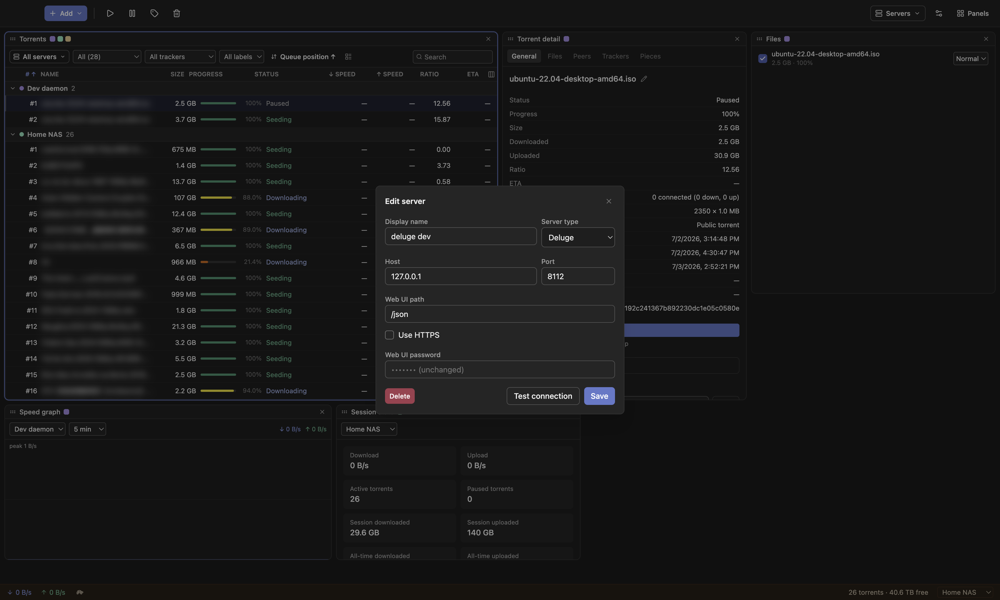
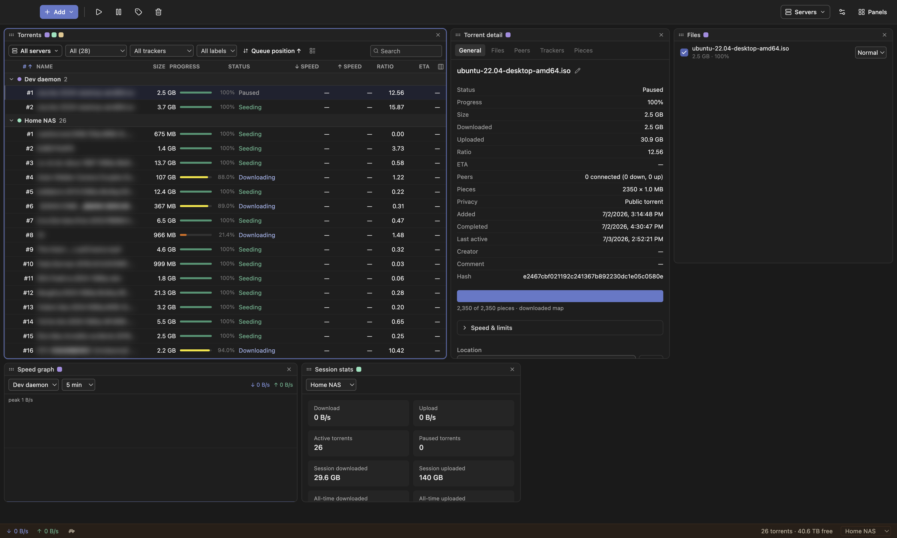
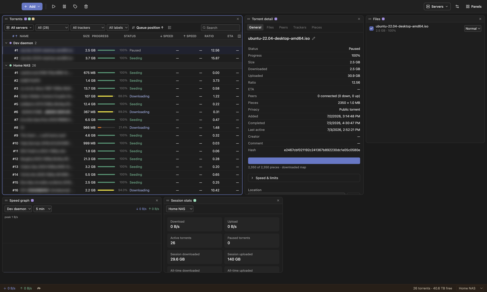
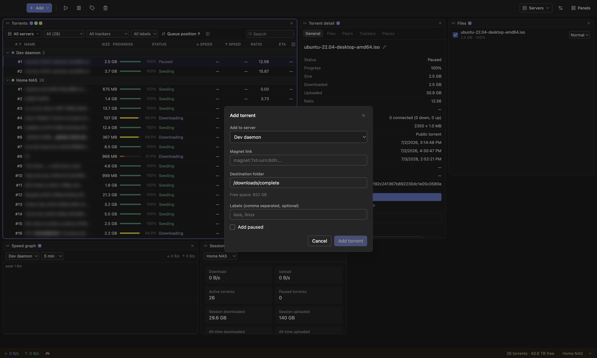
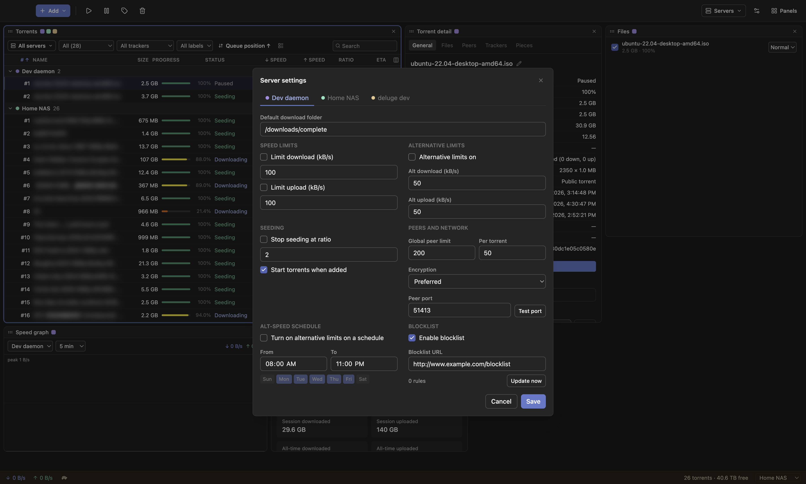

# Transmission Remote — User Guide

Transmission Remote is a desktop app for **remote-controlling BitTorrent daemons**. It
talks to **Transmission 4.x** and **Deluge 2.x** servers, and can show several of them at
once in a single, rearrangeable workspace.

It does not download torrents itself — it's a remote control for a daemon running
elsewhere (your NAS, a seedbox, another machine, or localhost).

> Torrent names in the screenshots below are intentionally blurred.

- [Requirements](#requirements)
- [Launching the app](#launching-the-app)
- [Adding a server](#adding-a-server)
- [The main window](#the-main-window)
- [Managing servers](#managing-servers)
- [Adding torrents](#adding-torrents)
- [Working with torrents](#working-with-torrents)
- [The detail panel](#the-detail-panel)
- [Panels](#panels)
- [Server settings](#server-settings)
- [Transmission vs. Deluge](#transmission-vs-deluge)
- [Keyboard shortcuts](#keyboard-shortcuts)
- [System tray](#system-tray)
- [Troubleshooting](#troubleshooting)

---

## Requirements

You need a running daemon to connect to:

- **Transmission 4.0+** with its RPC enabled (default port `9091`, path `/transmission/rpc`).
- **Deluge 2.x** with the **Web UI** (`deluge-web`) running (default port `8112`, path
  `/json`). The app talks to the Web UI, not the `deluged` core directly, so the Web UI
  must be running and bound to a daemon. See [Transmission vs. Deluge](#transmission-vs-deluge).

---

## Launching the app

Grab the release for your platform (macOS / Windows / Linux) and launch it like any other
app. The first time you open it with no servers configured, you'll be prompted to **Add a
server**.

---

## Adding a server

Open the **Servers** menu (top-right) → **Add server…**, or click **Add server** on the
welcome screen. Fill in the connection details:

| Field | Notes |
| --- | --- |
| **Display name** | Whatever you want to call it ("Home NAS", "Seedbox"). |
| **Server type** | **Transmission** or **Deluge** — this sets sensible defaults and tailors the form. |
| **Host** / **Port** | Address of the daemon. Defaults: Transmission `9091`, Deluge `8112`. |
| **RPC path** / **Web UI path** | Default `/transmission/rpc` or `/json`. |
| **Use HTTPS** | Enable if the daemon is behind TLS. A second checkbox lets you trust a self-signed certificate. |
| **Username / Password** | Transmission uses both. **Deluge uses only a Web UI password** (no username). |

Click **Test connection** to verify before saving — it reports the connected daemon's
version, or an actionable error (auth vs. TLS vs. network). Then **Save**.

You can add as many servers as you like; there is no single "primary" server — each panel
picks which server(s) it shows.

---

## The main window

The window is a **workspace of panels** you can rearrange freely. A typical layout:

- **Toolbar** (top): quick actions for the selection (start, pause, labels, remove), the
  **Add** menu, the **Servers** menu, and **Panels**.
- **Panels**: drag a panel by its header to move it; drag the bottom/corner edge to
  resize. New panels drop into the first free spot. Add panels from **Panels → Add
  panel**; remove one with the **✕** on its header. Your layout is saved automatically.
- **Server colors**: each server gets a stable pastel color, shown as small **squares next
  to a panel's title** (a Torrents panel showing several servers gets one square per
  server) and as **dots** next to server names. Same server, same color everywhere — so
  you always know whose data you're looking at.

---

## Managing servers

The **Servers** menu lists every configured server (with its color dot). Click one to
**edit** it, or choose **Add server…**.

---

## Adding torrents

Use the **Add** button (▾ for options), drag a `.torrent` file onto the window, or open a
`magnet:` link (the app can register as your system handler for magnets).

- **Add to server** — choose which server receives the torrent. Your last choice is
  remembered.
- **Magnet link / file** — paste a magnet (the clipboard is auto-detected) or pick a
  `.torrent`.
- **Destination folder** — defaults to the server's download folder; free space is shown.
- **Labels** — optional, comma-separated (Transmission; Deluge if its Label plugin is on).
- **Add paused** — add without starting.

For a single `.torrent` you can also uncheck individual files before adding.

---

## Working with torrents

**Select** a torrent by clicking it; ⌘/Ctrl-click to multi-select within one server (a
selection never spans servers). Selecting drives the detail panels.

**Actions** — from the toolbar or the right-click context menu:

- Start / Start now / Pause
- Verify local data
- Ask tracker for more peers (reannounce)
- Set labels…
- **Queue**: move to top / up / down / bottom, or set an exact position
- Remove… (optionally deleting local data)

**Filter, search, sort** — each Torrents panel has its own filter bar: filter by status,
tracker, or label, type in **Search**, and click a column header (table view) or the
**sort** control to reorder. Switch between **cards** and **table** views with the view
toggle. In table view you can reorder and resize columns, and — when sorted by queue
position — drag rows to reorder the queue.

**Multiple servers in one panel** — open the panel's server selector (the "All servers" /
server-count button) to show all servers or pick a specific set. Torrents are grouped
under a collapsible header per server; an unreachable server only errors its own section.

---

## The detail panel

Select a torrent to populate the **Torrent detail** panel. Its tabs:

- **General** — status, sizes, ratio, dates, pieces summary, creator/comment, hash, and a
  **Speed & limits** section for per-torrent download/upload caps, seed-ratio, connection
  limit, and (Transmission) priority, bandwidth group, and sequential download.
- **Files** — per-file sizes and progress in a collapsible tree; set file priorities or
  deselect files you don't want.
- **Peers** — connected peers.
- **Trackers** — the torrent's trackers.
- **Pieces** — a piece map (on Transmission, with per-piece availability; on Deluge it
  shows overall progress).

You can also add **individual** detail tabs (General, Files, …) as standalone panels.

---

## Panels

| Panel | What it shows | Server |
| --- | --- | --- |
| **Torrents** | The torrent list | One or several — pick in its server selector |
| **Torrent detail** (and single tabs) | The selected torrent | Follows your selection |
| **Session stats** | Totals: speeds, counts, all-time, free space | Its own picker |
| **Speed graph** | Live ↓/↑ throughput | Its own picker |

Add any of these from **Panels → Add panel**. Server-reading panels (Session stats, Speed
graph) each carry a small server picker in their header.

---

## Server settings

**Servers menu area → the settings (⚙) menu → Server settings** opens the daemon-wide
settings. The dialog is **tabbed, one tab per server**, so you can manage every daemon
from one place — each tab shows only what that server supports.

Covers: default download folder, global speed limits, seeding (stop-at-ratio,
start-added), peers/encryption/port, and — **Transmission only** — alternative-speed
limits with a schedule, and the blocklist.

---

## Transmission vs. Deluge

The app hides controls a server doesn't support, so you only see what works. In short:

- **Both**: list, add/remove, start/pause/verify/reannounce, detail tabs, per-torrent
  limits + file priorities, queue reorder, free space, global speed limits, sequential
  download.
- **Transmission only**: bandwidth groups, alternative-speed scheduler, blocklist,
  per-piece availability, per-tracker swarm scrape, path rename, port test.
- **Deluge**: labels require the Label plugin (one label per torrent); the pieces map
  shows progress only.

Full breakdown: **[DELUGE.md](DELUGE.md)**.

---

## Keyboard shortcuts

Work on the focused Torrents panel / current selection:

| Key | Action |
| --- | --- |
| **↑ / ↓** | Move selection up / down |
| **Shift + ↑ / ↓** | Extend selection (within one server) |
| **⌘/Ctrl + A** | Select all in a server |
| **Space** | Start / pause the selection |
| **Delete** (or ⌘/Ctrl + Backspace) | Remove… |
| **Esc** | Clear selection |

---

## System tray

The app can live in the system tray / menu bar: it shows combined speeds in the tooltip
and offers **Pause all / Resume all** (across every configured server) and show/hide.
Enable **close-to-tray** in Preferences to keep it running when you close the window.

---

## Troubleshooting

- **"Authentication failed"** — check the username/password (Deluge: the Web UI
  password). Use **Test connection** in the server editor.
- **"Certificate rejected"** — the server uses a self-signed cert; enable **Use HTTPS →
  Allow self-signed certificate** for that server.
- **"The server did not respond in time"** — the daemon is unreachable (wrong host/port,
  not running, or blocked by a firewall).
- **Deluge: "no configured daemon host" / can't connect** — the Deluge **Web UI must be
  running** and bound to a `deluged` host. The app auto-binds when there's a single host;
  if your Web UI knows several daemons and none is connected, connect one in the Deluge
  Web UI first.
- **A feature is missing** — it's likely hidden because the connected server doesn't
  support it (see [Transmission vs. Deluge](#transmission-vs-deluge)).
